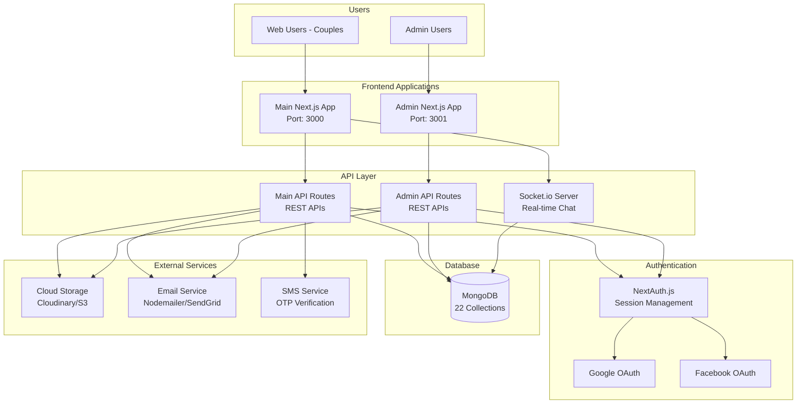
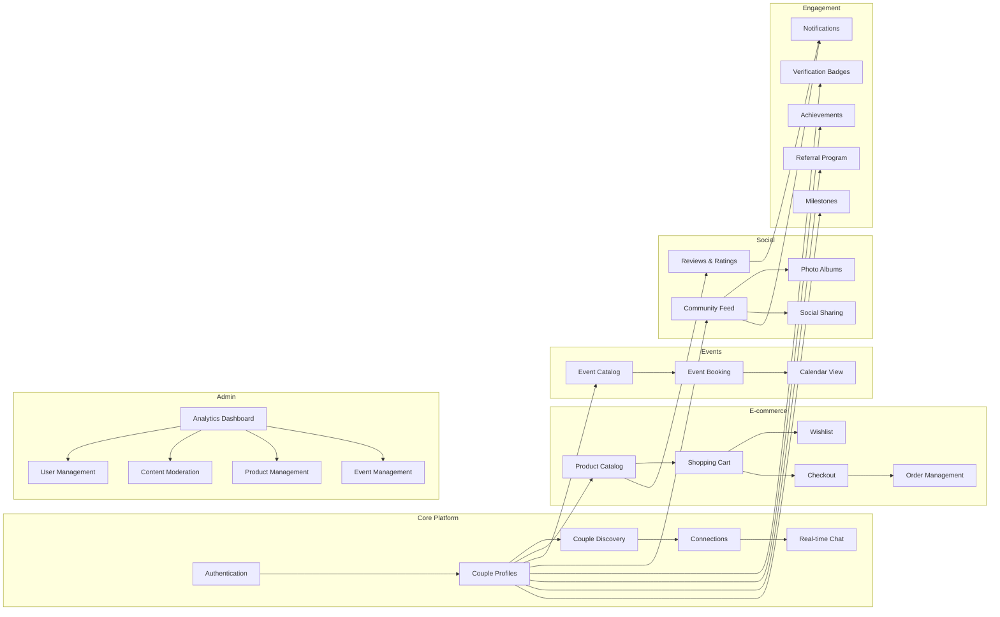
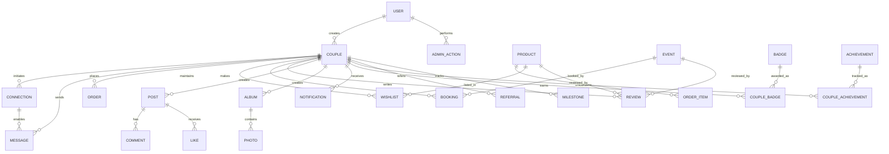
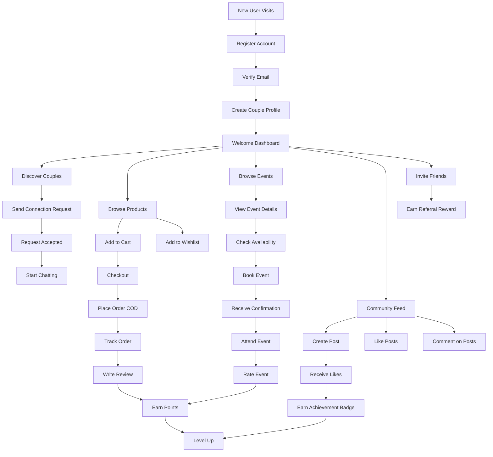
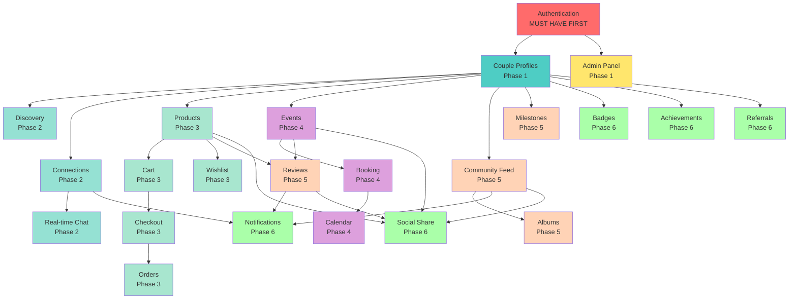
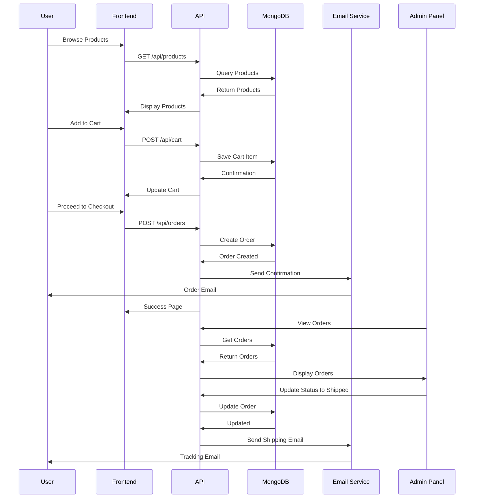
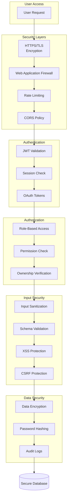
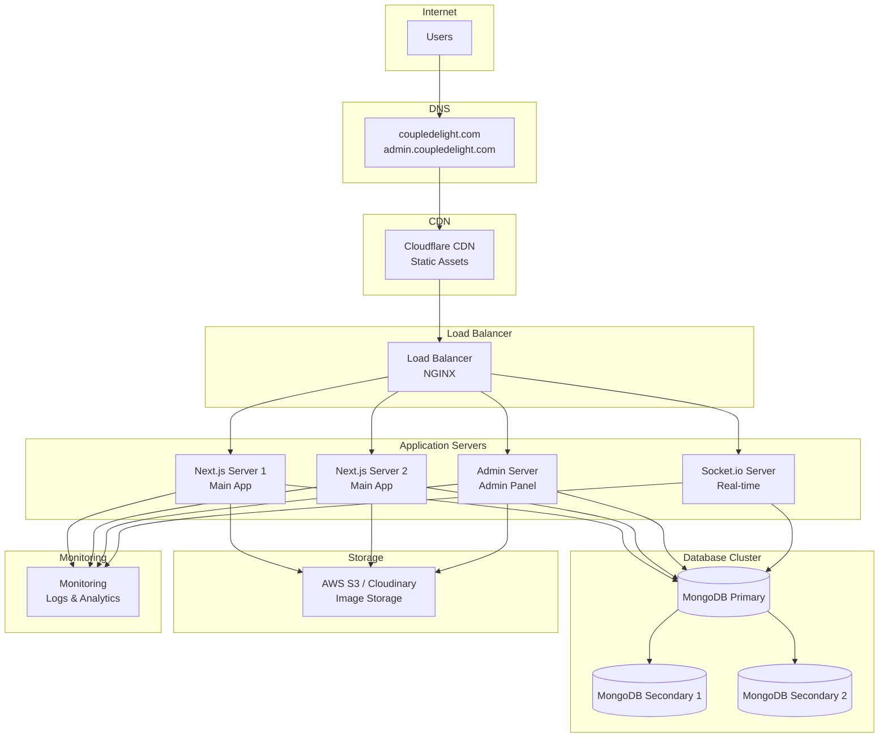
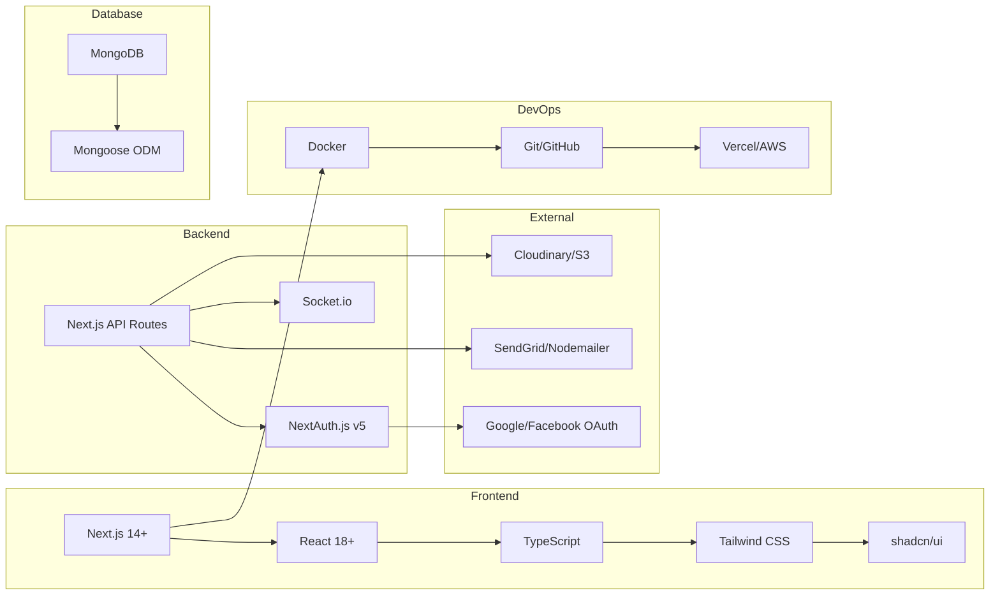

# CoupleDelight - Visual Architecture

## Complete System Architecture



## Feature Architecture Map



## Database Schema Relationships



## User Journey: Complete Flow



## API Architecture

```mermaid
graph TB
    subgraph Client Requests
        WebReq[Web Browser Request]
        MobileReq[Mobile App Request]
    end
    
    subgraph API Gateway
        Router[Next.js API Router]
    end
    
    subgraph Middleware
        Auth[Authentication Check]
        RateLimit[Rate Limiting]
        Validation[Input Validation]
        Logging[Request Logging]
    end
    
    subgraph API Endpoints - Main App
        AuthAPI[/api/auth/*]
        CoupleAPI[/api/couples/*]
        ConnAPI[/api/connections/*]
        MsgAPI[/api/messages/*]
        ProdAPI[/api/products/*]
        CartAPI[/api/cart/*]
        WishAPI[/api/wishlist/*]
        OrderAPI[/api/orders/*]
        EventAPI[/api/events/*]
        BookAPI[/api/bookings/*]
        ReviewAPI[/api/reviews/*]
        PostAPI[/api/posts/*]
        AlbumAPI[/api/albums/*]
        NotifAPI[/api/notifications/*]
        BadgeAPI[/api/badges/*]
        AchieveAPI[/api/achievements/*]
        ReferAPI[/api/referrals/*]
    end
    
    subgraph API Endpoints - Admin
        AdminAuth[/api/admin/auth/*]
        AdminUser[/api/admin/users/*]
        AdminProd[/api/admin/products/*]
        AdminEvent[/api/admin/events/*]
        AdminOrder[/api/admin/orders/*]
        AdminBook[/api/admin/bookings/*]
        AdminMod[/api/admin/moderation/*]
    end
    
    subgraph Business Logic
        Controllers[Controllers]
        Services[Services]
        Validators[Validators]
    end
    
    subgraph Data Access
        Models[Mongoose Models]
        DB[(MongoDB)]
    end
    
    WebReq --> Router
    MobileReq --> Router
    
    Router --> Auth
    Auth --> RateLimit
    RateLimit --> Validation
    Validation --> Logging
    
    Logging --> AuthAPI
    Logging --> CoupleAPI
    Logging --> ConnAPI
    Logging --> MsgAPI
    Logging --> ProdAPI
    Logging --> CartAPI
    Logging --> WishAPI
    Logging --> OrderAPI
    Logging --> EventAPI
    Logging --> BookAPI
    Logging --> ReviewAPI
    Logging --> PostAPI
    Logging --> AlbumAPI
    Logging --> NotifAPI
    Logging --> BadgeAPI
    Logging --> AchieveAPI
    Logging --> ReferAPI
    
    Logging --> AdminAuth
    Logging --> AdminUser
    Logging --> AdminProd
    Logging --> AdminEvent
    Logging --> AdminOrder
    Logging --> AdminBook
    Logging --> AdminMod
    
    AuthAPI --> Controllers
    CoupleAPI --> Controllers
    ProdAPI --> Controllers
    EventAPI --> Controllers
    AdminUser --> Controllers
    
    Controllers --> Services
    Services --> Validators
    Validators --> Models
    Models --> DB
```

## Feature Dependency Graph



## Data Flow: Order Processing



## Security Architecture



## Deployment Architecture



## Technology Stack Breakdown



---

## Key Statistics

### Database Collections: **22**
- Users
- Couples
- Connections
- Messages
- Products
- Orders
- Wishlists
- Events
- Bookings
- Reviews
- Badges
- CoupleBadges
- Achievements
- CoupleAchievements
- Posts
- Comments
- Albums
- Milestones
- Notifications
- Referrals
- Credits
- Reports

### API Endpoints: **100+**
- Authentication: 8
- Couples: 12
- Connections: 10
- Messages: 8
- Products: 15
- Cart & Orders: 18
- Wishlist: 8
- Events: 12
- Bookings: 10
- Reviews: 12
- Social Features: 25+
- Admin APIs: 30+

### Features: **70+**
Grouped into 10 major categories

### Implementation Time: **20 weeks**
Divided into 8 phases

---

This visual architecture provides a complete overview of the CoupleDelight platform. Ready to start building? 🚀