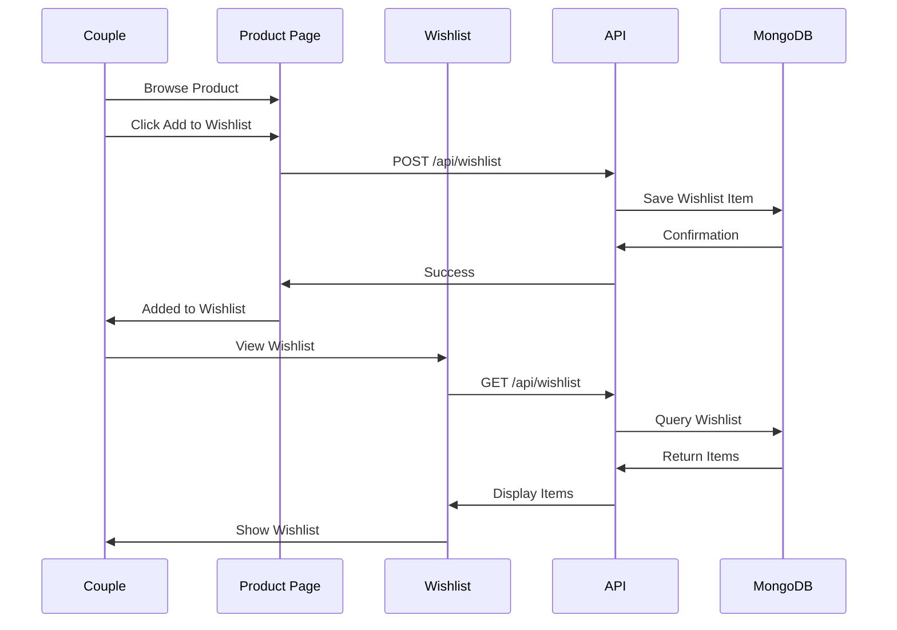
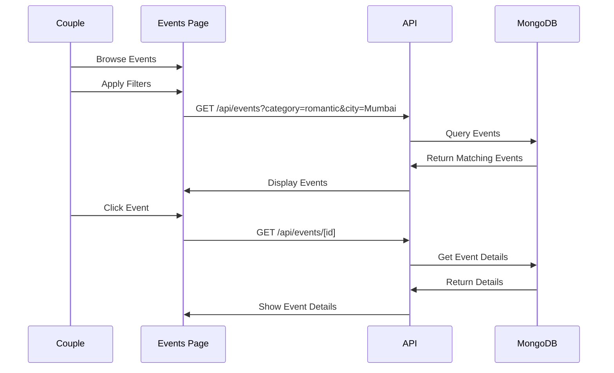
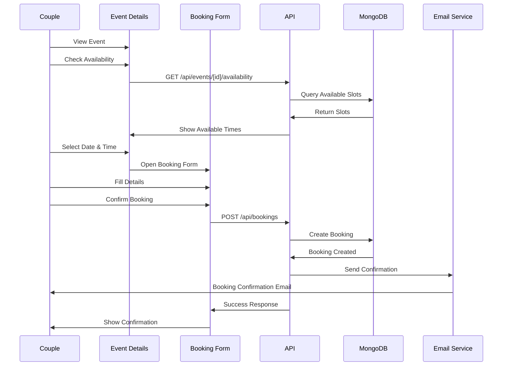

# Event Planning & Wishlist Features

## Overview

This document details the event planning and wishlist functionality added to the CoupleDelight platform.

## 1. Wishlist Feature

### Purpose
Allow couples to save products they're interested in for future purchase.

### Key Features
- Add/remove products from wishlist
- View all wishlist items
- Add notes to wishlist items
- Move items from wishlist to cart
- Share wishlist with partner

### User Flow


### API Endpoints
- `GET /api/wishlist` - Get all wishlist items for logged-in couple
- `POST /api/wishlist` - Add product to wishlist
- `DELETE /api/wishlist/[id]` - Remove item from wishlist

### Database Schema
```typescript
{
  _id: ObjectId,
  coupleId: ObjectId (ref: Couple),
  productId: ObjectId (ref: Product),
  addedAt: Date,
  notes: string
}
```

## 2. Event Planning Feature

### Purpose
Provide couples with curated date ideas and experiences they can book.

### Event Categories
1. **Restaurant** - Fine dining, casual dining, themed restaurants
2. **Adventure** - Outdoor activities, sports, adventure parks
3. **Romantic** - Sunset cruises, candlelight dinners, spa packages
4. **Entertainment** - Movies, concerts, theater shows
5. **Spa** - Couple massages, wellness retreats
6. **Outdoor** - Parks, gardens, nature trails
7. **Cultural** - Museums, art galleries, cultural events

### Key Features
- Browse events by category and location
- View detailed event information
- Check availability in real-time
- Book events with date/time selection
- Receive booking confirmations via email
- View upcoming bookings in calendar
- Cancel bookings (with policy)
- Rate and review past events

### Event Discovery Flow


### Booking Flow


### API Endpoints

#### User Endpoints
- `GET /api/events` - Get all events with filters
  - Query params: `category`, `city`, `priceMin`, `priceMax`, `date`
- `GET /api/events/[id]` - Get event details
- `GET /api/events/categories` - Get all categories
- `GET /api/events/[id]/availability` - Check availability for specific event

#### Booking Endpoints
- `GET /api/bookings` - Get user's bookings
- `POST /api/bookings` - Create new booking
- `GET /api/bookings/[id]` - Get booking details
- `PUT /api/bookings/[id]/cancel` - Cancel booking

#### Admin Endpoints
- `GET /api/admin/events` - List all events
- `POST /api/admin/events` - Create event
- `PUT /api/admin/events/[id]` - Update event
- `DELETE /api/admin/events/[id]` - Delete event
- `PUT /api/admin/events/[id]/availability` - Update availability

- `GET /api/admin/bookings` - List all bookings
- `GET /api/admin/bookings/[id]` - Get booking details
- `PUT /api/admin/bookings/[id]` - Update booking status
- `DELETE /api/admin/bookings/[id]` - Cancel/refund booking

### Database Schemas

#### Event Schema
```typescript
{
  _id: ObjectId,
  title: string,
  description: string,
  category: 'restaurant' | 'adventure' | 'romantic' | 'entertainment' | 'spa' | 'outdoor' | 'cultural',
  subcategory: string,
  location: {
    name: string,
    address: string,
    city: string,
    state: string,
    coordinates: {
      lat: number,
      lng: number
    }
  },
  images: string[],
  price: number,
  duration: string, // e.g., "2 hours", "Full day"
  maxCapacity: number,
  amenities: string[], // e.g., ["WiFi", "Parking", "Photography"]
  availability: [{
    date: Date,
    slots: [{
      time: string, // e.g., "10:00 AM", "2:00 PM"
      available: boolean,
      booked: number
    }]
  }],
  isActive: boolean,
  isFeatured: boolean,
  ratings: {
    average: number,
    count: number
  },
  tags: string[],
  createdBy: ObjectId (ref: User),
  createdAt: Date,
  updatedAt: Date
}
```

#### Booking Schema
```typescript
{
  _id: ObjectId,
  bookingNumber: string, // e.g., "BK20231120001"
  coupleId: ObjectId (ref: Couple),
  eventId: ObjectId (ref: Event),
  eventDetails: {
    title: string,
    location: string,
    price: number
  },
  bookingDate: Date,
  bookingTime: string,
  numberOfPeople: number,
  totalAmount: number,
  contactDetails: {
    name: string,
    phone: string,
    email: string
  },
  specialRequests: string,
  status: 'pending' | 'confirmed' | 'cancelled' | 'completed',
  paymentStatus: 'pending' | 'paid' | 'refunded',
  paymentMethod: 'COD' | 'online',
  confirmationSent: boolean,
  reminderSent: boolean,
  createdAt: Date,
  updatedAt: Date
}
```

## 3. UI Components

### Wishlist Components
- **WishlistButton** - Heart icon to add/remove from wishlist
- **WishlistPage** - Grid/list view of wishlist items
- **WishlistItem** - Card showing product with remove option
- **MoveToCart** - Button to transfer from wishlist to cart

### Event Components
- **EventCard** - Card showing event preview
- **EventGrid** - Grid layout for browsing events
- **EventFilters** - Sidebar/top filters for category, location, price
- **EventDetails** - Full event information page
- **AvailabilityCalendar** - Calendar showing available dates
- **TimeSlotSelector** - UI to select time slots
- **BookingForm** - Form to collect booking details
- **BookingConfirmation** - Success page after booking
- **MyBookings** - List of user's bookings
- **BookingCard** - Card showing individual booking

### Admin Components
- **EventManagement** - CRUD interface for events
- **EventForm** - Create/edit event form
- **AvailabilityManager** - UI to manage event availability
- **BookingManagement** - Interface to view and manage bookings
- **BookingDetails** - Detailed view of booking with actions

## 4. Integration Points

### With Existing Features
1. **Authentication** - All features require logged-in couples
2. **Profile** - Event preferences can be added to couple profile
3. **Chat** - Couples can share event links in chat
4. **Notifications** - Email notifications for bookings
5. **Dashboard** - Show upcoming events and wishlist items

### Calendar Integration
- Display bookings in calendar view
- Show event availability calendar
- Sync with user's personal calendar (future)

## 5. Email Notifications

### Booking Confirmation
```
Subject: Booking Confirmed - [Event Name]

Dear [Couple Name],

Your booking has been confirmed!

Booking Details:
- Event: [Event Name]
- Date: [Date]
- Time: [Time]
- Location: [Address]
- Booking Number: [Booking Number]

We look forward to seeing you!

[Event Organizer]
```

### Booking Reminder
```
Subject: Reminder: Your booking is tomorrow

Dear [Couple Name],

This is a reminder that you have a booking tomorrow:

Event: [Event Name]
Date: [Date]
Time: [Time]
Location: [Address]

See you soon!
```

### Cancellation Confirmation
```
Subject: Booking Cancelled - [Event Name]

Dear [Couple Name],

Your booking has been cancelled.

Booking Number: [Booking Number]
Refund Status: [Status]

If you have any questions, please contact us.
```

## 6. Business Rules

### Wishlist
- Maximum 100 items per couple
- Items automatically removed after 90 days of inactivity
- Notify when wishlisted item goes on sale

### Bookings
- Minimum 24 hours advance booking required
- Cancellation allowed up to 48 hours before event
- Refund policy: 100% refund if cancelled 48+ hours before
- No-show results in no refund
- Maximum 10 concurrent pending bookings per couple

### Events
- Events must be marked active to be visible
- Availability updated in real-time
- Sold out events hidden from search
- Past events archived automatically

## 7. Analytics & Metrics

### Wishlist Metrics
- Total wishlisted items
- Conversion rate (wishlist to purchase)
- Most wishlisted products
- Average wishlist size

### Event Metrics
- Total bookings per event
- Revenue per event category
- Popular time slots
- Cancellation rate
- Customer satisfaction ratings
- Booking lead time

## 8. Future Enhancements

1. **Collaborative Wishlist** - Partners can add items to shared wishlist
2. **Wishlist Sharing** - Share wishlist with friends/family
3. **Price Alerts** - Notify when wishlist items drop in price
4. **Event Recommendations** - AI-powered suggestions based on preferences
5. **Recurring Events** - Book regular date nights
6. **Group Bookings** - Book events with other couples
7. **Virtual Events** - Online experiences for couples
8. **Gift Vouchers** - Purchase event vouchers as gifts
9. **Loyalty Program** - Rewards for frequent bookings
10. **Social Features** - Share experiences, write reviews

## 9. Testing Checklist

### Wishlist Testing
- [ ] Add product to wishlist
- [ ] Remove product from wishlist
- [ ] View wishlist page
- [ ] Add notes to wishlist item
- [ ] Move item to cart
- [ ] Handle duplicate additions

### Event Testing
- [ ] Browse events by category
- [ ] Filter events by location/price
- [ ] View event details
- [ ] Check availability
- [ ] Make booking
- [ ] Receive confirmation email
- [ ] View my bookings
- [ ] Cancel booking
- [ ] Handle sold out events
- [ ] Handle past event dates

### Admin Testing
- [ ] Create new event
- [ ] Update event details
- [ ] Manage availability
- [ ] View all bookings
- [ ] Update booking status
- [ ] Cancel/refund booking
- [ ] Generate reports

---

This comprehensive feature set adds significant value to the CoupleDelight platform by providing both shopping convenience and experience planning capabilities.