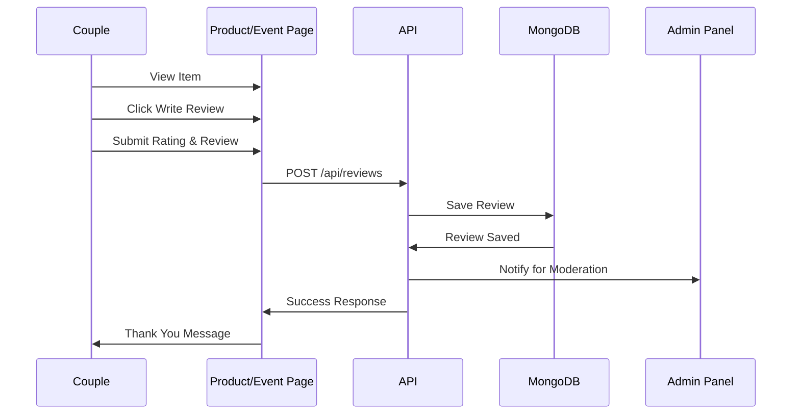
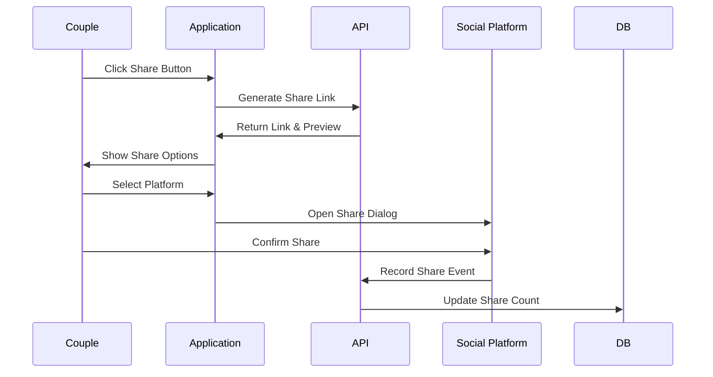
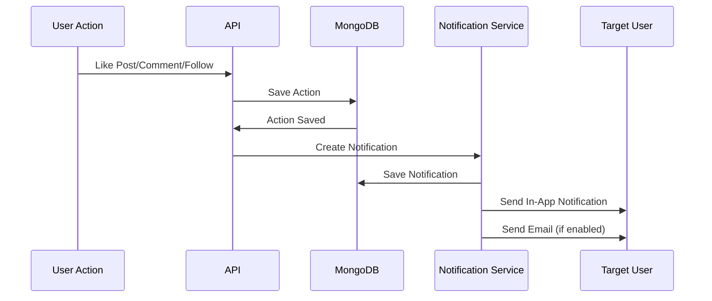

# Social & Engagement Features

## Overview

This document details the complete social and engagement features for the CoupleDelight platform, designed to build community, increase user engagement, and create a vibrant social ecosystem for couples.

---

## 1. Reviews & Ratings System

### Purpose
Allow couples to share their experiences with products and events, helping others make informed decisions.

### Features
- Rate products (1-5 stars)
- Rate events (1-5 stars)
- Write detailed reviews with text
- Upload photos with reviews
- Mark reviews as helpful
- Report inappropriate reviews
- Sort by: Most recent, Highest rated, Most helpful
- Verified purchase badge for product reviews
- Verified attendance badge for event reviews

### Database Schema

#### Review Schema
```typescript
{
  _id: ObjectId,
  type: 'product' | 'event',
  itemId: ObjectId (ref: Product or Event),
  coupleId: ObjectId (ref: Couple),
  rating: number (1-5),
  title: string,
  review: string,
  photos: string[],
  verified: boolean, // Verified purchase/attendance
  helpfulCount: number,
  helpfulBy: ObjectId[] (ref: Couple),
  reportCount: number,
  isApproved: boolean,
  moderatedBy: ObjectId (ref: User),
  createdAt: Date,
  updatedAt: Date
}
```

### API Endpoints
- `POST /api/reviews` - Submit review
- `GET /api/reviews?itemId=[id]&type=[type]` - Get reviews for item
- `PUT /api/reviews/[id]/helpful` - Mark review as helpful
- `POST /api/reviews/[id]/report` - Report review
- `PUT /api/reviews/[id]` - Edit own review
- `DELETE /api/reviews/[id]` - Delete own review

### Admin Endpoints
- `GET /api/admin/reviews` - List all reviews
- `PUT /api/admin/reviews/[id]/approve` - Approve review
- `DELETE /api/admin/reviews/[id]` - Remove review

---

## 2. Verification Badge System

### Purpose
Build trust by verifying couple profiles through various verification methods.

### Badge Types

#### Identity Verification
- **Email Verified** - Email address confirmed
- **Phone Verified** - Phone number verified via OTP
- **ID Verified** - Government ID verification (manual review)
- **Photo Verified** - Real couple photo verified

#### Activity Badges
- **Active Member** - Regular platform activity
- **Trusted Reviewer** - Consistently helpful reviews
- **Super Connector** - Many successful connections
- **Event Enthusiast** - Frequent event bookings

#### Achievement Badges
- **First Date** - Booked first event
- **Shopping Spree** - Made 10+ purchases
- **Social Butterfly** - 50+ connections
- **Content Creator** - 20+ posts

### Database Schema

#### Badge Schema
```typescript
{
  _id: ObjectId,
  name: string,
  slug: string, // e.g., 'email-verified'
  description: string,
  icon: string, // Icon URL or name
  category: 'verification' | 'activity' | 'achievement',
  color: string, // Badge color
  criteria: {
    type: string, // Type of requirement
    value: number // Required value
  },
  isActive: boolean,
  createdAt: Date
}
```

#### CoupleBadge Schema
```typescript
{
  _id: ObjectId,
  coupleId: ObjectId (ref: Couple),
  badgeId: ObjectId (ref: Badge),
  earnedAt: Date,
  isVisible: boolean, // Can hide badges
  displayOrder: number
}
```

### API Endpoints
- `GET /api/badges` - Get all available badges
- `GET /api/couples/[id]/badges` - Get couple's badges
- `POST /api/verification/email` - Request email verification
- `POST /api/verification/phone` - Request phone verification
- `POST /api/verification/id` - Submit ID for verification

---

## 3. Social Sharing

### Purpose
Allow users to share content on external social media platforms and within the app.

### Shareable Content
- Couple profiles
- Products
- Events
- Posts
- Photo albums
- Milestones

### Supported Platforms
- WhatsApp
- Facebook
- Instagram
- Twitter
- Copy Link

### Features
- Generate shareable links with preview
- Track share metrics
- Custom share messages
- Open Graph meta tags
- Deep linking support

### Database Schema

#### Share Schema
```typescript
{
  _id: ObjectId,
  coupleId: ObjectId (ref: Couple),
  contentType: 'profile' | 'product' | 'event' | 'post' | 'album' | 'milestone',
  contentId: ObjectId,
  platform: string, // 'whatsapp', 'facebook', etc.
  sharedAt: Date,
  clicks: number
}
```

### API Endpoints
- `POST /api/share` - Record share action
- `GET /api/share/link?type=[type]&id=[id]` - Generate shareable link
- `GET /api/share/stats/[contentId]` - Get share statistics

---

## 4. Referral Program

### Purpose
Encourage user growth through word-of-mouth marketing with rewards.

### Features
- Unique referral code per couple
- Track referral sign-ups
- Reward system for referrer and referee
- Referral leaderboard
- Tiered rewards (5, 10, 25 referrals)

### Rewards Structure
- **Referrer**: ₹100 credit per successful referral
- **Referee**: ₹50 welcome bonus
- **Milestone Bonus**: 
  - 5 referrals: ₹250 bonus
  - 10 referrals: ₹500 bonus
  - 25 referrals: ₹1500 bonus + Premium Badge

### Database Schema

#### Referral Schema
```typescript
{
  _id: ObjectId,
  referrerCoupleId: ObjectId (ref: Couple),
  referralCode: string, // Unique code
  referredEmail: string,
  referredCoupleId: ObjectId (ref: Couple),
  status: 'pending' | 'signed_up' | 'completed',
  rewardAmount: number,
  rewardClaimed: boolean,
  claimedAt: Date,
  createdAt: Date,
  completedAt: Date
}
```

#### Credit Schema
```typescript
{
  _id: ObjectId,
  coupleId: ObjectId (ref: Couple),
  amount: number,
  type: 'referral' | 'welcome' | 'milestone' | 'refund',
  source: string, // Description
  expiresAt: Date,
  createdAt: Date
}
```

### API Endpoints
- `GET /api/referrals/code` - Get my referral code
- `GET /api/referrals/stats` - Get referral statistics
- `GET /api/referrals/leaderboard` - Get top referrers
- `POST /api/referrals/apply?code=[code]` - Apply referral code during signup
- `POST /api/credits/claim` - Claim referral reward
- `GET /api/credits/balance` - Get credit balance

---

## 5. Achievement Badge System

### Purpose
Gamify the platform experience to increase engagement and retention.

### Achievement Categories

#### Social Achievements
- **Ice Breaker** - Send first connection request
- **Networker** - 10 accepted connections
- **Popular Couple** - 50+ connections
- **Chat Master** - 100 messages sent

#### Shopping Achievements
- **First Purchase** - Complete first order
- **Shopaholic** - 10 purchases
- **Big Spender** - Total spending ₹10,000+
- **Review Champion** - 10 product reviews

#### Event Achievements
- **Date Night** - First event booking
- **Adventure Seeker** - Book 3 adventure events
- **Romantic Soul** - Book 5 romantic events
- **Explorer** - Book events in 3 different cities

#### Content Achievements
- **First Post** - Create first post
- **Storyteller** - 10 posts created
- **Photographer** - Create 3 photo albums
- **Influencer** - 100+ post likes

### Database Schema

#### Achievement Schema
```typescript
{
  _id: ObjectId,
  name: string,
  slug: string,
  description: string,
  icon: string,
  category: 'social' | 'shopping' | 'event' | 'content',
  points: number, // Achievement points
  requirement: {
    action: string, // e.g., 'connections_made'
    count: number
  },
  reward: {
    credits: number, // Reward credits
    badge: ObjectId (ref: Badge)
  },
  rarity: 'common' | 'rare' | 'epic' | 'legendary',
  isActive: boolean,
  createdAt: Date
}
```

#### CoupleAchievement Schema
```typescript
{
  _id: ObjectId,
  coupleId: ObjectId (ref: Couple),
  achievementId: ObjectId (ref: Achievement),
  progress: number, // Current progress
  required: number, // Required count
  isCompleted: boolean,
  completedAt: Date,
  notified: boolean
}
```

### API Endpoints
- `GET /api/achievements` - Get all achievements
- `GET /api/achievements/my-progress` - Get my achievement progress
- `GET /api/achievements/leaderboard` - Achievement leaderboard

---

## 6. Community Feed (Stories & Posts)

### Purpose
Create a social feed where couples can share their experiences, photos, and stories.

### Post Types
- **Text Post** - Share thoughts and updates
- **Photo Post** - Share photos with captions
- **Experience Post** - Share event/date experiences
- **Purchase Post** - Share product reviews
- **Milestone Post** - Celebrate special moments

### Features
- Create, edit, delete posts
- Add multiple photos
- Tag products/events
- Set privacy (public, connections only, private)
- Like, comment, share posts
- Report inappropriate content
- Hashtag support
- Mention couples

### Database Schema

#### Post Schema
```typescript
{
  _id: ObjectId,
  coupleId: ObjectId (ref: Couple),
  type: 'text' | 'photo' | 'experience' | 'purchase' | 'milestone',
  content: string,
  photos: string[],
  taggedItems: [{
    type: 'product' | 'event',
    itemId: ObjectId
  }],
  taggedCouples: ObjectId[] (ref: Couple),
  hashtags: string[],
  privacy: 'public' | 'connections' | 'private',
  likes: ObjectId[] (ref: Couple),
  likeCount: number,
  commentCount: number,
  shareCount: number,
  reportCount: number,
  isApproved: boolean,
  isFeatured: boolean,
  createdAt: Date,
  updatedAt: Date
}
```

#### Comment Schema
```typescript
{
  _id: ObjectId,
  postId: ObjectId (ref: Post),
  coupleId: ObjectId (ref: Couple),
  content: string,
  likes: ObjectId[] (ref: Couple),
  likeCount: number,
  reportCount: number,
  createdAt: Date,
  updatedAt: Date
}
```

### API Endpoints
- `GET /api/feed` - Get community feed (paginated)
- `POST /api/posts` - Create post
- `GET /api/posts/[id]` - Get post details
- `PUT /api/posts/[id]` - Edit post
- `DELETE /api/posts/[id]` - Delete post
- `POST /api/posts/[id]/like` - Like post
- `DELETE /api/posts/[id]/like` - Unlike post
- `POST /api/posts/[id]/comments` - Add comment
- `GET /api/posts/[id]/comments` - Get comments
- `POST /api/posts/[id]/share` - Share post
- `POST /api/posts/[id]/report` - Report post

---

## 7. Photo Albums

### Purpose
Allow couples to organize and showcase their photos in albums.

### Features
- Create unlimited albums
- Add title and description to albums
- Upload multiple photos
- Set album cover photo
- Privacy settings (public, connections, private)
- Share albums
- Download album
- Comment on albums

### Database Schema

#### Album Schema
```typescript
{
  _id: ObjectId,
  coupleId: ObjectId (ref: Couple),
  title: string,
  description: string,
  coverPhoto: string,
  photos: [{
    url: string,
    caption: string,
    uploadedAt: Date
  }],
  privacy: 'public' | 'connections' | 'private',
  likes: ObjectId[] (ref: Couple),
  likeCount: number,
  commentCount: number,
  viewCount: number,
  createdAt: Date,
  updatedAt: Date
}
```

### API Endpoints
- `GET /api/albums` - Get couple's albums
- `POST /api/albums` - Create album
- `GET /api/albums/[id]` - Get album details
- `PUT /api/albums/[id]` - Update album
- `DELETE /api/albums/[id]` - Delete album
- `POST /api/albums/[id]/photos` - Add photos
- `DELETE /api/albums/[id]/photos/[photoId]` - Remove photo
- `POST /api/albums/[id]/like` - Like album
- `POST /api/albums/[id]/comments` - Comment on album

---

## 8. Milestone Celebrations

### Purpose
Help couples track and celebrate important dates and achievements.

### Milestone Types
- **Relationship Milestones**
  - Dating anniversary
  - Engagement anniversary
  - Wedding anniversary
  - First date anniversary
  
- **Platform Milestones**
  - 1st connection
  - 1st purchase
  - 1st event booking
  - 100 days on platform
  - 1 year on platform

- **Custom Milestones**
  - User-defined special dates
  - Personal achievements

### Features
- Add custom milestones
- Automatic milestone tracking
- Milestone reminders (7 days, 1 day before)
- Share milestone on feed
- Milestone badges
- Gift suggestions for milestones
- Event recommendations for milestones

### Database Schema

#### Milestone Schema
```typescript
{
  _id: ObjectId,
  coupleId: ObjectId (ref: Couple),
  type: 'relationship' | 'platform' | 'custom',
  title: string,
  description: string,
  date: Date,
  recurring: boolean, // For anniversaries
  reminderSent: boolean,
  celebrated: boolean, // Posted/shared
  postId: ObjectId (ref: Post),
  createdAt: Date
}
```

### API Endpoints
- `GET /api/milestones` - Get couple's milestones
- `POST /api/milestones` - Add milestone
- `PUT /api/milestones/[id]` - Update milestone
- `DELETE /api/milestones/[id]` - Delete milestone
- `GET /api/milestones/upcoming` - Get upcoming milestones
- `POST /api/milestones/[id]/celebrate` - Mark as celebrated

---

## 9. Notification System

### Purpose
Keep users engaged with real-time notifications for all social interactions.

### Notification Types

#### Social Notifications
- New connection request
- Connection accepted
- New message
- Post liked
- Post commented
- Mentioned in post
- Tagged in photo

#### Shopping Notifications
- Order confirmed
- Order shipped
- Order delivered
- Wishlist item on sale
- Product back in stock

#### Event Notifications
- Booking confirmed
- Event reminder (1 day before)
- Event reminder (2 hours before)
- New review on attended event

#### Achievement Notifications
- New badge earned
- Achievement unlocked
- Milestone reached
- Referral reward earned

### Features
- In-app notifications
- Email notifications (configurable)
- Push notifications (future)
- Mark as read/unread
- Notification preferences
- Notification history

### Database Schema

#### Notification Schema
```typescript
{
  _id: ObjectId,
  coupleId: ObjectId (ref: Couple),
  type: 'social' | 'shopping' | 'event' | 'achievement',
  category: string, // Specific notification type
  title: string,
  message: string,
  icon: string,
  actionUrl: string, // Link to relevant content
  relatedId: ObjectId, // ID of related content
  isRead: boolean,
  readAt: Date,
  createdAt: Date
}
```

#### NotificationPreference Schema
```typescript
{
  _id: ObjectId,
  coupleId: ObjectId (ref: Couple),
  emailNotifications: {
    social: boolean,
    shopping: boolean,
    events: boolean,
    achievements: boolean,
    marketing: boolean
  },
  pushNotifications: {
    social: boolean,
    shopping: boolean,
    events: boolean,
    achievements: boolean
  },
  updatedAt: Date
}
```

### API Endpoints
- `GET /api/notifications` - Get notifications (paginated)
- `GET /api/notifications/unread-count` - Get unread count
- `PUT /api/notifications/[id]/read` - Mark as read
- `PUT /api/notifications/read-all` - Mark all as read
- `DELETE /api/notifications/[id]` - Delete notification
- `GET /api/notifications/preferences` - Get preferences
- `PUT /api/notifications/preferences` - Update preferences

---

## 10. Content Moderation & Reporting

### Purpose
Maintain a safe and respectful community environment.

### Reportable Content
- Posts
- Comments
- Reviews
- Profiles
- Messages
- Photos

### Report Reasons
- Inappropriate content
- Spam
- Harassment
- Fake profile
- Copyright violation
- Other (with description)

### Moderation Workflow
1. User reports content
2. Content flagged for review
3. Admin reviews report
4. Action taken:
   - Approve (no violation)
   - Remove content
   - Warn user
   - Suspend user
   - Ban user

### Database Schema

#### Report Schema
```typescript
{
  _id: ObjectId,
  reporterId: ObjectId (ref: Couple),
  contentType: 'post' | 'comment' | 'review' | 'profile' | 'message' | 'photo',
  contentId: ObjectId,
  reason: string,
  description: string,
  status: 'pending' | 'reviewing' | 'resolved' | 'dismissed',
  reviewedBy: ObjectId (ref: User),
  reviewNotes: string,
  action: 'none' | 'removed' | 'warned' | 'suspended' | 'banned',
  createdAt: Date,
  resolvedAt: Date
}
```

### API Endpoints
- `POST /api/reports` - Submit report
- `GET /api/reports/my-reports` - View my reports

### Admin Endpoints
- `GET /api/admin/reports` - List all reports
- `GET /api/admin/reports/pending` - Pending reports
- `PUT /api/admin/reports/[id]/review` - Review report
- `POST /api/admin/reports/[id]/action` - Take action

---

## User Flow Diagrams

### Review Submission Flow


### Social Sharing Flow


### Notification Flow


---

## Admin Features

### Review Moderation
- View all reviews
- Approve/reject reviews
- Edit reviews (if inappropriate)
- Ban reviewers (repeat offenders)
- View reported reviews
- Analytics on review sentiment

### Badge Management
- Create new badges
- Edit badge criteria
- Manually award badges
- View badge statistics
- Featured badge display

### Content Moderation
- Review reported content
- Remove inappropriate posts
- Warn/suspend/ban users
- View content analytics
- Moderation queue
- Bulk actions

### Social Analytics
- Most active users
- Popular posts
- Engagement metrics
- Growth trends
- User retention
- Feature usage stats

---

## Gamification Strategy

### Point System
- Connection made: 10 points
- Post created: 5 points
- Comment made: 2 points
- Review written: 15 points
- Event booked: 20 points
- Purchase made: 25 points
- Referral completed: 50 points

### Leaderboards
- **Monthly Leaders** - Reset each month
- **All-Time Leaders** - Cumulative
- **Category Leaders** - By activity type
- **Reward top 10** - Special badges

### Level System
- **Level 1-10**: Beginner (0-500 points)
- **Level 11-25**: Regular (501-2000 points)
- **Level 26-50**: Pro (2001-5000 points)
- **Level 51+**: Legend (5000+ points)

---

## Privacy & Safety

### Privacy Controls
- Profile visibility settings
- Post privacy options
- Album privacy settings
- Block/unblock couples
- Restrict comments
- Hide from search

### Safety Features
- Report system
- Content moderation
- Verified badges
- Age verification
- Community guidelines
- User blocking

---

## Performance Considerations

### Optimization Strategies
1. **Lazy Loading** - Load posts/images as user scrolls
2. **Caching** - Cache feed and popular content
3. **Image Optimization** - Compress and resize images
4. **Pagination** - Limit items per page
5. **CDN** - Serve static content via CDN
6. **Database Indexing** - Index frequently queried fields

### Scalability
- Horizontal scaling for API servers
- Database sharding for large datasets
- Message queue for notifications
- Background jobs for heavy processing

---

## Implementation Priority

### Phase 1 (MVP)
1. Reviews & Ratings
2. Basic verification (email/phone)
3. Social sharing
4. Notification system

### Phase 2
5. Community feed
6. Photo albums
7. Like/comment features
8. Basic achievements

### Phase 3
9. Referral program
10. Advanced badges
11. Milestones
12. Content moderation tools

---

This comprehensive social and engagement feature set transforms CoupleDelight from a simple dating and shopping platform into a vibrant social community for couples.